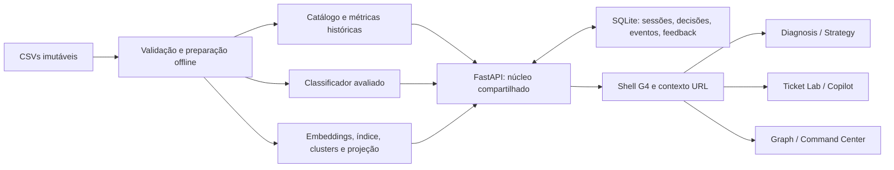

# Arquitetura compartilhada

## 1. Produto e limites

Uma única aplicação reúne análise histórica, inferência, assistência e observabilidade. O Início e as seis lentes são consumidores de um núcleo comum. A pergunta muda; identidade, proveniência, decisões e evidências permanecem consistentes. [Dados e métricas](03-dados-e-metricas.md) é o contrato de significado; [design](04-design-e-experiencia.md) é o contrato visual.

O repositório contém briefing, CSVs e identidade G4, agora consumidos por uma aplicação local única. O README original estima volumes diferentes dos arquivos locais. Esta implementação usa as contagens verificadas. Não afirmar autenticidade de produção: DS1 contém placeholders e resoluções genéricas.

## 2. Estrutura mínima proposta

```text
process-002-support/
  README.md                           # briefing original, preservado
  customer_support_tickets.csv         # DS1, somente leitura
  all_tickets_processed_improved_v3.csv # DS2, somente leitura
  G4_Design_System.pdf e logos          # assets originais
  docs/                               # este conjunto
  scripts/prepare_data.py              # validação e agregações
  scripts/train.py                     # benchmark, avaliação, classificador
  scripts/build_semantic.py            # embeddings, índice, clusters, projeção
  backend/app.py                       # FastAPI e entrega do frontend
  backend/pipeline.py                  # inferência, recuperação e políticas
  backend/sessions.py                  # SQLite, replay, eventos, feedback
  frontend/index.html
  frontend/src/main.ts                 # shell, contexto, navegação
  frontend/src/views/                  # seis consumidores dos contratos
  frontend/src/styles.css              # tokens G4 e componentes comuns
  artifacts/<artifact_version>/        # catálogo SQLite, modelos e índices derivados
  runtime/                            # sessões locais, fora de publicação
  tests/                              # checks de invariantes e fluxo completo
```

Os caminhos acima existem nesta entrega. Dados derivados não sobrescrevem CSVs; o catálogo sanitizado é `artifacts/v1/catalog.sqlite3`, lido em modo somente leitura pelo backend. Não há migration destrutiva nem endpoint de exclusão neste escopo.



## 3. Escolhas técnicas e motivos

| Necessidade | Escolha inicial | Limite / alternativa avaliada |
|---|---|---|
| UI | HTML/CSS + TypeScript vanilla + Vite | Um shell e módulos de rota; sem framework de componentes/global store adicional. Vite empacota dependências locais e produz build reproduzível. |
| Backend | FastAPI, Python e contratos tipados | Um processo local serve API e build estático; sem microserviços. |
| Sessões | SQLite da biblioteca padrão | Adequado à demo local, eventos ordenados e feedback persistido. Não prometer múltiplos workers/replay distribuído. |
| ML | scikit-learn, TF-IDF + modelo linear | Benchmark contra baseline majoritário; escolher por Macro F1, calibração e custo medidos. Não pressupor acurácia. |
| Semântica | Sentence-Transformers, encoder multilíngue candidato | Validar inglês do corpus e PT-BR da UI/entrada. Fixar modelo, revisão, dimensão e licença no manifesto. |
| Busca | FAISS `IndexFlatIP`, embeddings normalizados | Busca exata inicialmente; sem serviço vetorial externo. Avaliar ANN apenas se latência medida exigir. |
| Clusters | HDBSCAN | Permite ruído e pertencimento incerto. Validar no espaço original ou redução intermediária; a projeção 2D não define verdade semântica. Leiden/Louvain ficam como alternativa se densidade não separar grupos úteis. |
| Projeção | UMAP persistido, com transformação de novos pontos | Só visualização; distância 2D não é similarity. Sem refazer o layout completo a cada evento. |
| Grafo | Sigma.js + Graphology | Renderização WebGL e câmera atendem navegação por vizinhança. Cytoscape é alternativa para edição/algoritmos interativos; D3 exigiria mais comportamento próprio. Escolher versão estável, não alpha. |
| Atualizações | Polling incremental, inicialmente a cada 1 s | Mesmo contrato para Graph/Command; sem conexão permanente. SSE só se o intervalo não atender medição; WebSocket apenas com necessidade bidirecional comprovada. |
| Copilot | Recuperação e resposta extractiva rastreável | Funciona offline sem LLM. Gerador externo é opcional e nunca necessário para o fluxo de evidências/feedback. |

A escolha é de arquitetura, não promessa de desempenho. Fixar versões compatíveis após smoke test do ambiente e registrar mudanças justificadas. Python do sistema pode não ter wheels ML compatíveis; usar ambiente isolado na própria pasta com versão validada.

Referências oficiais verificadas: [Vite](https://vite.dev/guide/), [Sigma](https://www.sigmajs.org/docs/), [similaridade no Sentence-Transformers](https://sbert.net/docs/sentence_transformer/usage/semantic_textual_similarity.html), [cosseno no FAISS](https://github.com/facebookresearch/faiss/wiki/MetricType-and-distances), [transformação UMAP](https://umap-learn.readthedocs.io/en/latest/transform.html), [HDBSCAN para novos pontos](https://hdbscan.readthedocs.io/en/latest/prediction_tutorial.html), [calibração scikit-learn](https://scikit-learn.org/stable/modules/calibration.html), [SSE](https://developer.mozilla.org/en-US/docs/Web/API/Server-sent_events/Using_server-sent_events). A decisão de usar polling e o tamanho inicial são escolhas deste projeto.

## 4. Identidade, versões e proveniência

| Entidade | Campos mínimos e invariantes |
|---|---|
| Dataset | `dataset_id=ds1|ds2`, checksum, linhas, schema, limitações |
| Ticket histórico | `ticket_id`, `dataset_id`, texto sanitizado, atributos disponíveis; `ds1:<Ticket ID>` ou `ds2:<sha256>` |
| Normalização de ID DS2 | Unicode NFC, trim e espaços normalizados; preservar caixa. Guardar regra/versionamento e detectar colisões. Casefold para agrupamento ML é outra regra. |
| Ticket da sessão | `session:<session_uuid>:<ticket_uuid>`, `source_ticket_id` quando replay, `source`, texto, `created_at` técnico; nunca fingir que este é timestamp histórico |
| Espaço semântico | `space_id` incorpora dataset e versão de encoder/corpus/clustering/projeção; DS1 e DS2 não compartilham vizinhança por acidente |
| Cluster | `cluster_id` vinculado ao `space_id`, tamanho, membros, métricas com denominador; mudanças de artefato invalidam IDs antigos explicitamente |
| Inferência | `prediction_id`, `ticket_id`, categoria, confidence, método/calibração, `model_version`, `policy_version`, `space_id`, latência, vizinhos e decisões |
| Métrica | `key`, `value` ou null, unidade, numerador/denominador, `source`, filtros, período, versão, status/motivo de indisponibilidade |
| Sugestão | `suggestion_id`, ticket, fontes, contexto, texto, gerador/versão, limitações |
| Feedback | `feedback_id`, suggestion/prediction ID, decisão, edição ou justificativa, timestamp; novas versões preservam histórico |

`source` é `historical`, `simulation`, `user_created` ou `model_evaluation`. `inference_mode` é `precomputed` ou `online`. `content_origin` identifica o CSV mesmo quando o evento tem source simulation. Esses eixos não são intercambiáveis.

O classificador treinado no DS2 prevê `Topic_group`. `Ticket Type` do DS1 é outra taxonomia. DS1 usa atributos observados e recuperação própria; não exibir confidence do classificador DS2 como se validada no DS1. Prioridade e routing de tickets DS2 são sugestões de política, com regra explicável; automação real em plataformas externas está fora do escopo.

## 5. Contexto, filtros e rotas

Rotas canônicas: `/#/diagnosis`, `/#/automation`, `/#/ticket-lab`, `/#/copilot`, `/#/graph`, `/#/command-center`.

Query da rota conserva `dataset_id`, `source`, `session_id`, `space_id`, `ticket_id`, `cluster_id`, `alert_id`, `model_version` e filtros suportados. Texto/PII não vai para URL. Backend é fonte da sessão e inferências; URL é fonte da seleção navegável. Filtros visuais do Graph não mudam retroativamente o resultado da inferência.

- Selecionar DS2 desabilita canal/CSAT/TTR com motivo; não reaproveita filtros DS1 silenciosamente.
- Navegação por alertas conserva membros exatos e período da evidência, mesmo após atualização da sessão.
- Troca de dataset explicita incompatibilidades e oferece retorno ao contexto anterior.
- Abrir deep link funciona após reload. Sessão/artefato ausente mostra estado recuperável, nunca dados de outra sessão.
- Duas abas do navegador consultam o mesmo `session_id`. Trocar de rota não reinicia replay.

## 6. Contrato inicial de API

| Endpoint proposto | Responsabilidade |
|---|---|
| `GET /api/catalog` | Datasets, capacidades, modelos e espaços carregados |
| `GET /api/diagnosis` | Métricas, cortes, qualidade e evidências filtradas DS1 |
| `GET /api/tickets` / `GET /api/tickets/{ticket_id}` | Lista paginada/detalhe sanitizado, com origem |
| `GET /api/models/current` | Manifesto, avaliação de teste, benchmark/calibração |
| `POST /api/tickets/analyze` | Validar texto, inferir, buscar e persistir resultado real; idempotency key |
| `GET /api/spaces/{space_id}/graph` | Nível, cluster/foco, limites, edges reais, cursor e totais |
| `POST /api/copilot/suggestions` | Recuperar resoluções e contexto; retornar sugestão ou evidência insuficiente |
| `POST /api/feedback` | Aceitar/editar/rejeitar sugestão ou corrigir decisão, sem enviar mensagem externa |
| `POST /api/sessions` | Criar sessão configurada e isolada |
| `POST /api/sessions/{session_id}/control` | play, pause, speed, reset; reset retorna nova sessão |
| `GET /api/sessions/{session_id}/snapshot` | Estado, métricas e `last_seq` consistentes |
| `GET /api/sessions/{session_id}/events?after_seq=N` | Eventos posteriores ordenados, `next_seq`, `has_more` |
| `GET /api/sessions/{session_id}/alerts/{alert_id}` | Membros/threshold/janela que geraram o alerta |
| `GET /api/health` | Saúde do serviço e disponibilidade dos artefatos |

Especificar schema concreto ao implementar em FastAPI e exportar OpenAPI. Valores não disponíveis usam null e motivo. Erros têm código, mensagem e request ID, sem stacktrace/segredos no browser. Limites de texto e paginação são validados no servidor; rejeitar vazio, IDs incompatíveis, fontes indevidas e números não finitos. APIs nunca aceitam caminho arbitrário de arquivo/modelo.

## 7. Inferência e qualidade

Separar treino, validação/calibração e teste por grupos de texto normalizado, com seed e IDs persistidos. Vetorizador aprende apenas no treino. Seleção de hiperparâmetros, limiares de confiança e duplicatas não usa teste. Near-duplicates exigem auditoria de vazamento adicional antes de alegar generalização. Registrar baseline, accuracy, Macro F1, F1 por classe, matriz de confusão, suporte por classe, distribuição de confiança, curva de calibração e latência.

Confidence do classificador, similarity de cosseno, força de associação a cluster e score de duplicata são valores distintos. Não chamar similarity de probabilidade de duplicata. Flags de rotulagem suspeita são candidatos à revisão, nunca correções automáticas. Input fora do domínio, idioma não avaliado, baixa confiança e contexto sensível exigem revisão. Threshold inicial é configuração experimental até validado com amostra anotada; auto-route é proposta de fila, não resolução automática.

Manifesto prende modelo, vetor de classes, preprocessamento, encoder/revisão, índice/checksum, UMAP, clustering, política e relatório. Recusar combinações incompatíveis. Não carregar serializações fornecidas por usuários.

## 8. Sessão, replay e eventos

Estados: STOPPED → PLAYING ↔ PAUSED → COMPLETED. PLAY inicia ou retoma; PAUSE interrompe novas admissões e permite finalizar processamento em curso; COMPLETED não volta ao início sem nova sessão. RESET cria nova sessão e preserva logs. SPEED altera apenas agenda simulada (1×/2×/5×/10×), nunca inventa redução na latência do modelo.

Evento mínimo: `event_id`, `session_id`, `seq`, `event_type`, `ticket_id`, `source_ticket_id`, `source`, `content_origin`, `dataset_id`, `occurred_at`, `simulation_time`, `model_version`, `policy_version`, `space_id`, `inference_mode`, `payload`. `seq` é monotônico por sessão e único; replay/idempotência não duplicam tickets ou contadores.

Pipeline lógico: TICKET_ARRIVED → CLASSIFICATION_STARTED → CLASSIFICATION_COMPLETED → EMBEDDING_CREATED → NEIGHBORS_FOUND → DUPLICATE_ANALYSIS → PRIORITY_ANALYSIS → ROUTING_DECISION → HUMAN_OR_AUTO_DECISION → GRAPH_NODE_CREATED → DASHBOARD_UPDATED. Se etapas acontecerem em outra ordem técnica, registrar a ordem real. Artefatos reutilizados são eventos de leitura de resultado precomputed, sem fingir execução online. Falha registra evento e motivo, mantém trilha e permite retry idempotente. RESPONSE_RETRIEVED/SUGGESTION_GENERATED são opcionais.

Snapshot e cursor são lidos na mesma transação. Cliente primeiro aplica snapshot em `last_seq`, depois busca eventos seguintes e deduplica por ID/seq. Processamento do replay ocorre no servidor, independentemente do número de telas; não é disparado por cada GET. Polling usa backoff ao falhar e retoma do último cursor. Cursor inválido recebe instrução de ressincronização.

Histórico tem índice base imutável. Tickets manuais ficam em overlay de sessão; busca considera base + overlay autorizado, remove o próprio ticket e limita resultados. Replay conserva referência à linha original: não acusar como duplicata a própria referência histórica. Nós de ocorrências distintas têm IDs distintos, mas métricas mostram também quantidade de conteúdos únicos.

Replay de chegadas não produz tempo de resolução/CSAT novo. `queue` mede processamento IA pendente; `backlog` operacional depende de status/ações observadas. Eventos de resolução só poderiam existir com ação explicitamente implementada e registrada.

## 9. Incidentes e crescimento semântico

Usar janela em simulation_time e contagem de tickets/unique source IDs por cluster com coesão mínima configurada. Alertas registram membros, limiar, janela, categoria dominante, score e versão de regra. Repetir a mesma fonte não pode inflar incidência. Aplicar deduplicação de alertas/cooldown explícito.

Sem cronologia válida, sequência aleatória estratificada e cenário concentrado em um cluster são ambos simulações. Cenário de burst aparece como `SIMULATED INCIDENT SCENARIO — conteúdo do dataset histórico`. O limiar demonstra uma regra a validar, não significância estatística nem incidente de produção confirmado.

## 10. Segurança, falhas e implantação

Sanitizar PII antes de indexar/exibir; nome/email/idade/gênero não são features do classificador. Preservar original só nos CSVs locais. Texto de ticket/resolução é conteúdo não confiável: escapar HTML e não obedecer instruções contidas nele. LLM externo, quando existir, recebe somente contexto sanitizado e configuração explícita; segredos ficam no servidor.

Inicialmente bind local, mesma origem e sessão local; deploy público exige acesso controlado, limites de requisição, dados sanitizados e armazenamento persistente. Não publicar CSV cru nem modelos de fonte desconhecida. Sem serviços pagos ou envio de mensagens no núcleo.

Falha de polling mantém páginas históricas, modelo, Lab, Copilot e Graph consultáveis diretamente. Falha de LLM mantém recuperação e geração extractiva. Falha de encoder/índice mostra indisponibilidade real, preservando diagnóstico; nunca substituir resultado por mock.

Build e verificações precedem qualquer commit/push. Push requer autorização explícita do usuário. Exclusões e migrações destrutivas requerem autorização explícita; não fazem parte desta arquitetura.
