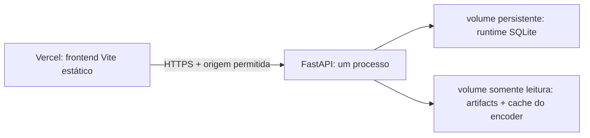

# Operação e deploy

Esta entrega executa localmente como uma aplicação FastAPI e também permite separar frontend e API. O catálogo sanitizado é a fonte canônica em SQLite; FAISS, embeddings, modelo e projeções são artefatos imutáveis derivados. O SQLite de sessões precisa de volume persistente.

## Checkpoints operacionais

- [x] OPS-01: `catalog.sqlite3` contém os 56.306 tickets sanitizados e `catalog_predictions` contém 47.837 inferências históricas do DS2.
- [x] OPS-02: `SUPPORT_ARTIFACTS_DIR` e `SUPPORT_RUNTIME_DB` permitem apontar artefatos e sessões para volumes externos.
- [x] OPS-03: `VITE_API_BASE_URL` permite compilar o frontend para uma API externa; a origem permitida é validada por teste e smoke visual.
- [x] OPS-04: o backend retorna `503` e estado `degraded` em `/api/health` se faltar artefato obrigatório ou a estrutura/contagens do catálogo SQLite estiverem incompletas.
- [ ] OPS-05: autenticação, limitação de taxa, revisão formal de privacidade e monitoramento de produção. CORS é uma allowlist de browsers, não controle de acesso.

## Execução local

Na pasta `challenges/process-002-support/`:

```sh
.venv/bin/python -m uvicorn backend.app:app --host 127.0.0.1 --port 8000
```

Abra `http://127.0.0.1:8000` no navegador. A primeira preparação em uma máquina nova requer os comandos de reprodução em [SOLUCAO.md](../SOLUCAO.md).

## Modelo de publicação



Vercel hospeda somente `frontend/`. O backend não deve ser uma função serverless da Vercel: ele mantém um worker de replay e usa SQLite para sessões, que exigem um processo único e disco persistente.

No host Python do backend, prepare os artefatos antes de subir o serviço e defina, no mínimo:

```sh
SUPPORT_ARTIFACTS_DIR=/data/support/artifacts/v1
SUPPORT_RUNTIME_DB=/data/support/runtime/support.sqlite3
HF_HOME=/data/support/huggingface
SUPPORT_ALLOWED_ORIGINS=https://SEU-PROJETO.vercel.app
```

Caso o cache Hugging Face não fique em `HF_HOME`, informe `SUPPORT_ENCODER_PATH` com o diretório local do encoder fixado no manifesto. Suba um único processo Uvicorn para preservar a coordenação do replay e a semântica do SQLite.

## Vercel

Depois de publicar o backend em um host com volume persistente e configurar a origem dele em `SUPPORT_ALLOWED_ORIGINS`, faça o deploy do frontend:

No projeto Vercel, use `challenges/process-002-support/frontend` como Root Directory, `pnpm install --frozen-lockfile` como Install Command, `pnpm run build` como Build Command e `dist` como Output Directory.

```sh
cd frontend
pnpm dlx vercel link
pnpm dlx vercel env add VITE_API_BASE_URL production
pnpm dlx vercel --prod
```

No segundo comando, informe `https://SEU-BACKEND.exemplo.com`. A variável precisa existir antes do build remoto porque o Vite a incorpora na compilação. Antes de expor o endpoint publicamente, conclua OPS-05 ou mantenha o backend protegido pela camada de acesso do provedor.
