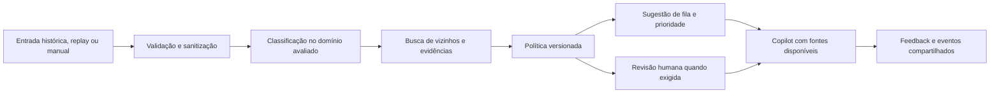

# Spec 02 — AI Automation Strategy

**Rota:** `/#/automation`  
**Pergunta:** quais atividades vale assistir com IA, com quais evidências, controles e condições de retorno?  
**Estado:** interface e políticas demonstráveis implementadas; a carteira dinâmica por oportunidade e a validação operacional permanecem pendentes.  
**Contratos:** [arquitetura](../01-arquitetura-compartilhada.md), [dados e métricas](../03-dados-e-metricas.md), [design](../04-design-e-experiencia.md).

## 1. Papel da lente

Traduzir o diagnóstico e a avaliação técnica em uma proposta operacional: ticket entra, recebe classificação e evidências, a política decide por sugestão ou revisão, e o humano controla decisões que exigem julgamento. Compartilha catálogo, modelo, política, filtros e fontes com Lab, Copilot, Graph e Command Center.

A página não “liga” automações externas. Ela torna oportunidades, riscos, requisitos e hipóteses de ROI examináveis. A demonstração funcional acontece no mesmo pipeline usado pelo Ticket Lab e pelas sessões simuladas; resultados de teste e replay são identificados pela origem.

## 2. Estrutura funcional

| Bloco | Conteúdo e decisão apoiada |
|---|---|
| Contexto | Fonte, recorte vindo do Diagnosis, contagem e versão de política/modelo |
| Oportunidades | Atividade, população potencial, evidência, viabilidade, risco, intervenção humana e status de validação |
| Limites de automação | Ações sensíveis e casos com baixa confiança, dados insuficientes ou domínio não avaliado |
| Fluxo proposto | Entrada → classificação → recuperação → política → sugestão/revisão → feedback e observabilidade |
| Avaliação | Benchmark e métricas reais do modelo, quando disponíveis, com partição e versão |
| Cenário de ROI | Premissas editáveis, fórmulas, capacidade liberada, custos e limites; sem resultados pré-fabricados |
| Próximo passo | Abrir Lab, Copilot, Graph ou Command Center no contexto da oportunidade |

Usar tabela/cartões com detalhes expansíveis e uma representação simples do fluxo. Não criar um editor de workflow ou sistema de regras de uso geral para descrever um pipeline único.

## 3. Carteira inicial de hipóteses

Cada oportunidade terá ID estável, nome, atividade atendida, fonte, filtros/elegibilidade, evidências com IDs, limite da fonte, decisão humana, dependências, métrica de piloto e estado (`hypothesis`, `evaluated`, `pilot`). As contagens vêm das APIs de catálogo/diagnóstico; dados de modelo vêm de `GET /api/models/current`. Não hardcodear percentuais de automação.

| Hipótese | Evidência disponível | Condição de uso | O que medir no piloto |
|---|---|---|---|
| Classificação assistida IT | 47.837 textos rotulados em 8 grupos no DS2 | Modelo avaliado, domínio/idioma compatíveis, abstenção e correção humana | Macro F1, suporte por classe, cobertura, latência, correções |
| Sugestão de roteamento | Categoria prevista e política de filas versionada | Fila é proposta de política; CSV não contém destino correto nem desempenho de equipes | Aceitação, desvios, tempo humano de triagem e retrabalho |
| Apoio à prioridade | Prioridade observada no DS1; regras explícitas para entradas sem rótulo | Prioridade sugerida difere da observada; revisar risco e não alegar modelo validado no DS2 | Concordância humana, falsos rebaixamentos de urgência, revisões e esforço |
| Recuperação de chamados semelhantes | Texto das duas fontes, separado por espaço | Vizinhos com similaridade real, origem e exclusão do próprio ticket | Relevância humana, utilidade e taxa de evidência insuficiente |
| Resposta assistida | 2.769 registros DS1 com `Resolution` | Revisar qualidade histórica; apresentar fontes; aprovação humana antes de qualquer uso externo | Apoio factual, correções, aceitação e esforço total com revisão |
| Candidatos a duplicata | Repetição observada no DS1 e relações semânticas | Similaridade só sinaliza candidato; conteúdo templateado exige cautela | Precisão anotada, falso positivo e tempo de revisão |
| Sinais de concentração de assuntos | Clusters/contagens em uma sessão explicitamente simulada | Regra e janela versionadas; não inferir incidente de produção | Membros únicos, coesão, falsos alertas e ação do analista |

Volume é dimensão separada de risco e esforço de implantação. Preferir justificativa visível a um “score de oportunidade” opaco. Um ranking pode ordenar por critérios explicitamente selecionados; não fabricar pesos ou números de impacto sem método.

As oito classes IT e os cinco tipos do DS1 permanecem separados. Uma oportunidade do DS2 não recebe CSAT ou TTR de vizinhos DS1 como se fossem seus resultados. Os 8.469 e 47.837 registros medem amostras; não representam demanda mensal prevista.

## 4. O que exige humano

| Situação | Conduta proposta | Limite |
|---|---|---|
| Evidência insuficiente, baixa confiança ou idioma/domínio não avaliado | Abster-se de decisão automática e encaminhar para revisão | Nenhuma categoria forçada para preencher a interface |
| Acesso, privilégios, dados sensíveis ou assuntos de pessoas | Recuperar contexto e sugerir fila; exigir verificação humana apropriada | Não conceder acesso, mudar privilégios ou decidir sobre emprego |
| Reembolso, cancelamento, valores ou compromissos contratuais | Produzir assistência contextual com aprovação humana | Não prometer pagamento, prazo ou política inexistente |
| Alta prioridade, risco descrito ou caso ambíguo | Preservar prioridade observada e sinalizar motivo de revisão | Rótulo histórico não comprova severidade atual |
| Possível duplicata | Mostrar registros e evidência para comparação | Não unir, excluir, fechar ou resolver tickets automaticamente |
| Sugestão de resposta | Humano pode aceitar, editar ou rejeitar; registrar feedback | Aceitar significa registrar decisão local, não enviar mensagem |

Casos concretos devem ser selecionados do catálogo real e sanitizados. Categoria isolada é um sinal de cautela, não prova de risco. O painel deve explicar o motivo de cada revisão com base na política aplicada e nos campos disponíveis.

## 5. Fluxo conectado

Esse desenho descreve responsabilidades; a ordem técnica e eventos efetivamente executados seguem a arquitetura. Se forem usados artefatos pré-computados, a demonstração deve dizer isso. “Automação” neste escopo significa assistência local e processamento do protótipo, sem ação em sistema externo.

- Abrir oportunidade preserva recorte e exibe a população elegível calculada, com exclusões justificadas.
- “Testar classificação” abre Lab com dataset/modelo compatível, sem texto pessoal na URL.
- “Investigar relações” abre Graph com espaço/cluster/ticket efetivos da oportunidade.
- “Revisar resposta” abre Copilot no ticket selecionado; DS2 sozinho não fornece resolução.
- “Observar no replay” abre Command Center com sessão existente ou permite criar uma sessão explícita; navegar não inicia ou reinicia replay.
- Feedback, resultado e alerta consultam os mesmos IDs em todas as lentes.

## 6. Simulador de retorno

Usar o [contrato de ROI](../03-dados-e-metricas.md#7-roi-hipótese-mensurável-sem-converter-espera-em-esforço). Inputs mínimos: volume mensal elegível, adoção, minutos de trabalho humano por atividade antes/depois, custo/hora, custo por execução, número de execuções, custo fixo mensal, investimento e horizonte.

Cada input mostra unidade, origem da premissa e data/versão do cenário. Campos faltantes bloqueiam apenas os resultados dependentes. Valores não finitos, negativos onde proibidos, adoção fora de 0–100% e horizonte não positivo são rejeitados com erro junto ao campo. Zero permanece válido quando semanticamente possível; dividir por zero gera indisponibilidade explicada.

Resultados:

- Horas humanas liberadas por mês, incluindo revisão/correção/fallback no tempo proposto.
- Capacidade valorizada por mês, sem afirmar redução de despesa realizada.
- Custos incrementais e benefício líquido mensal.
- ROI no horizonte e payback, quando definidos.
- Cenários conservador/base/otimista apenas com premissas explícitas; mudança de cenário mostra quais valores mudaram.

Não multiplicar TTR por custo/hora. Não usar valores ilustrativos do briefing como histórico. A referência de 30.000 tickets/ano só pode ser opção de premissa do cenário, com divisão uniforme por 12 declarada. O DS1 possui 8.469 registros locais, sem período operacional validado.

Se tempo proposto exceder o anterior, mostrar benefício negativo. Não somar atividades que disputam os mesmos minutos sem deduplicação explícita. Se o usuário altera a oportunidade, conservar ou invalidar premissas incompatíveis de maneira visível; nunca transferir silenciosamente uma estimativa de outro recorte.

## 7. Avaliação e política

Dados de teste e benchmark exibem `model_version`, fonte, split, suporte e data da execução. Macro F1, acurácia, baseline e abstenção devem vir do relatório calculado. Antes da avaliação, mostrar “Ainda não avaliado”. Não apresentar metas como resultados.

Confidence do classificador, score de similaridade e força de associação ao cluster têm legendas distintas. Limiar experimental aparece como experimental, e só sustenta uma proposta de decisão local. Alterar parâmetro de cenário de ROI não altera modelo, limiar ou política. Se o produto oferecer edição de política posteriormente, precisará versionar e registrar essa mudança; não faz parte do formulário financeiro inicial.

Mostrar os limiares de classificação, evidência de recuperação e candidato a duplicata com nome, valor, método de escolha, versão e condição de abstenção. Seus valores vêm do artefato/política, não de constantes decorativas da interface. Escolha validada usa apenas treino/validação; até existir evidência, identificá-la como experimental. Superar um limiar não elimina revisão obrigatória por risco ou falta de dados. Um score não calibrado jamais recebe o rótulo “probabilidade de acerto”.

## 8. Estados e acessibilidade

| Estado | Comportamento |
|---|---|
| Sem filtro | Mostrar carteira com populações das respectivas fontes, nunca uma contagem operacional somada |
| Recorte sem elegíveis | Explicar a regra e manter acesso às evidências; não estimar benefício positivo |
| Modelo ausente | Estratégia e hipóteses continuam consultáveis; teste classificador fica indisponível |
| Cenário incompleto | Exibir campos faltantes e fórmulas; não completar com premissas ocultas |
| Benefício nulo/negativo | Mostrar resultado e motivo; payback “Não ocorre neste cenário” |
| Falha na consulta | Preservar filtros/premissas e permitir nova tentativa |

Fluxo visual tem equivalente textual. Oportunidades e ações são alcançáveis por teclado. Inputs usam labels e unidades, validação local legível e validação no servidor quando persistidos. Alterações numéricas anunciam um resumo e não deslocam foco. Fonte, risco, revisão humana e natureza estimada não dependem de cor.

## 9. Checkpoints e aceite

- [ ] AUT-01: carteira usa evidências locais, contagens consultadas e IDs recuperáveis, com DS1/DS2 separados.
- [x] AUT-02: cada oportunidade diferencia observação, hipótese, política e resultado avaliado.
- [x] AUT-03: limites humanos da seção 4 aparecem antes da ação de testar; baixa evidência permite abstenção.
- [ ] AUT-04: links para Lab/Copilot/Graph/Command Center preservam contexto e usam o pipeline compartilhado.
- [x] AUT-05: benchmark mostra números calculados e versão; antes de existir relatório, aparece como não avaliado.
- [x] AUT-06: ROI calcula esforço por atividade, inclui revisão/fallback/custos e não deriva economia de timestamps.
- [x] AUT-07: valores ausentes, negativos, não finitos, adoção inválida, custo zero e benefício negativo têm tratamento correto.
- [x] AUT-08: oportunidades sobrepostas não somam automaticamente o mesmo benefício; limites ficam explícitos.
- [x] AUT-09: nenhum botão concede acesso, fecha ticket, efetua reembolso ou envia mensagem externa.
- [x] AUT-10: uma verificação executável usa um cenário aritmético conhecido e os casos custo zero/benefício negativo, sem apresentá-los como dados reais.
- [ ] AUT-11: as interações principais funcionam por teclado e o fluxo possui alternativa textual completa.

## 10. Evolução condicionada a evidência

Integrações reais, aplicação automática de políticas, retorno financeiro realizado e retreino com feedback exigem validação operacional adicional. A primeira entrega deve permitir observar, testar, revisar e medir a proposta com fontes locais e trilha de decisão; o objetivo do piloto é produzir as evidências que ainda faltam.
